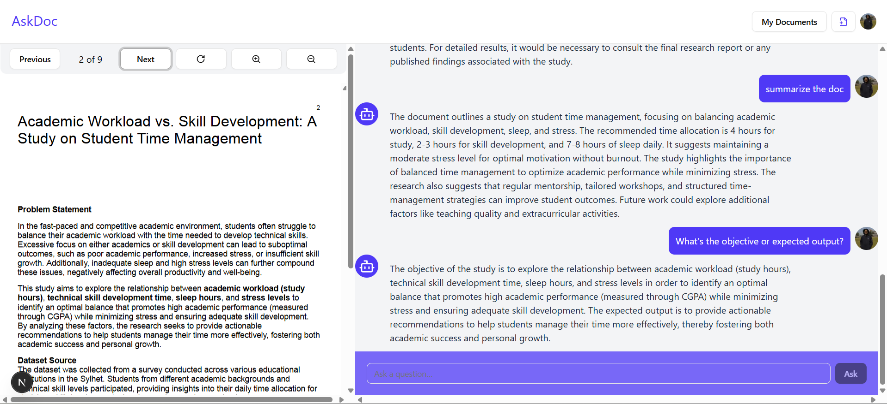

# AskDoc

A Next.js application that allows users to upload PDF files, securely store them in Supabase, and interact with them using a chat-based AI interface powered by LangChain, OpenAI, and Pinecone for embeddings. Chat history is stored in Firebase Firestore, enabling real-time conversations.



## Features

* **Secure PDF Storage**: Upload and store your PDF files in a public Supabase Storage bucket.
* **AI-Powered Q\&A**: Ask questions about your PDFs and get accurate, context-aware answers.
* **Real-Time Chat**: Chat messages (human & AI) are stored in Firebase Firestore and update live in the UI.
* **In-Browser PDF Viewing**: View your PDF files seamlessly within the app using `react-pdf`.
* **Cross-Device Access**: Access your files and chat from any device.

## Prerequisites

* Node.js v18+ and npm
* A Supabase project with a Storage bucket for PDFs
* A Firebase project with Firestore enabled
* A Pinecone account and API key
* An OpenAI API key
* A Clerk account for authentication

## Getting Started

1. **Clone the repository**

   ```bash
   git clone https://github.com/yourusername/askdoc.git
   cd askdoc
   ```

2. **Install dependencies**

   ```bash
   npm install
   ```

3. **Environment Variables**
   Create a `.env.local` file in the project root with:

   ```env
   # Supabase (client-side)
   NEXT_PUBLIC_SUPABASE_URL=https://your-supabase-url.supabase.co
   NEXT_PUBLIC_SUPABASE_ANON_KEY=your_supabase_anon_key

   # OpenAI
   OPENAI_API_KEY=your_openai_key

   # Pinecone
   PINECONE_API_KEY=your_pinecone_key

   # Clerk
   NEXT_PUBLIC_CLERK_PUBLISHABLE_KEY=your_clerk_key
   CLERK_SECRET_KEY=your_clerk_secret

   # Firebase
   NEXT_PUBLIC_FIREBASE_API_KEY=your_firebase_api_key
   NEXT_PUBLIC_FIREBASE_AUTH_DOMAIN=your_project.firebaseapp.com
   NEXT_PUBLIC_FIREBASE_PROJECT_ID=your_project_id
   NEXT_PUBLIC_FIREBASE_STORAGE_BUCKET=your_bucket.appspot.com
   NEXT_PUBLIC_FIREBASE_MESSAGING_SENDER_ID=your_sender_id
   NEXT_PUBLIC_FIREBASE_APP_ID=your_app_id
   ```

4. **Initialize Firestore Security Rules and Indexes**
   Ensure your Firestore rules allow authenticated users to read and write their own chat documents under `users/{userId}/files/{fileId}/chat`.

5. **Run the development server**

   ```bash
   npm run dev
   ```

   Open [http://localhost:3000](http://localhost:3000) to view the app.

## Firebase Firestore Structure

```
users/{userId}/files/{fileId}/chat/{messageId}
```

* Each `message` document has:

  * `role`: "human" or "ai"
  * `message`: text content
  * `createdAt`: timestamp

## Scripts

* `npm run dev` - Start development server
* `npm run build` - Build for production
* `npm start` - Start production server
* `npm run lint` - Run ESLint

## Key Dependencies

| Package                                | Purpose                        |
| -------------------------------------- | ------------------------------ |
| `next`                                 | React framework                |
| `@clerk/nextjs`                        | Authentication                 |
| `@supabase/supabase-js`                | PDF storage                    |
| `firebase` & `firebase-admin`          | Real-time chat storage         |
| `react-firebase-hooks`                 | React hooks for Firestore      |
| `@langchain/openai`, `@langchain/core` | AI chains and embeddings       |
| `@pinecone-database/pinecone`          | Vector database for embeddings |
| `react-pdf`                            | PDF rendering in browser       |
| `tailwindcss` & `daisyui`              | Styling framework              |

*For full details, see **`package.json`**.*

## Folder Structure

```plaintext
/
├─ app/                   # Next.js App Router pages
├─ components/            # React components (FileUploader, Chat, PdfView)
├─ hooks/                 # Custom React hooks (useChatMessages)
├─ lib/                   # Clients (supabaseClient, pineconeClient)
├─ public/                # Static assets
├─ scripts/               # (none for Firestore chat)
├─ styles/                # Global styles
├─ .env.local             # Environment variables
└─ README.md
```

## Contributing

Contributions welcome! Please open an issue or submit a pull request.

## License

MIT © Nayeb Ahmed Qureshi
